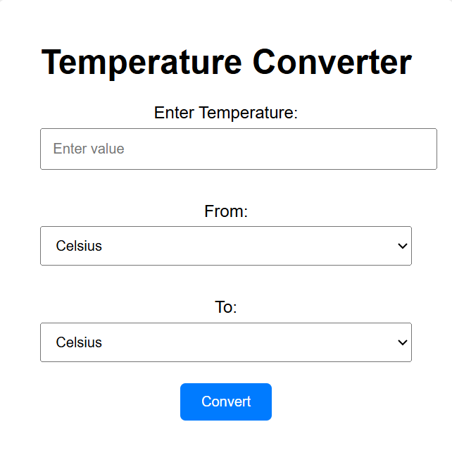

# 🌡️ Tri-Scale Temperature Converter  

A simple and interactive **Temperature Converter** that converts between **Celsius, Fahrenheit, and Kelvin**.  
This project is built using **HTML, CSS, and JavaScript**.  

---

## 🚀 Features
- Convert temperature between:
  - 🌡️ **Celsius (°C)**
  - 🔥 **Fahrenheit (°F)**
  - ❄️ **Kelvin (K)**
- Clean and responsive UI  
- Instant conversion with real-time updates  
- Beginner-friendly project for learning JavaScript  

---

## 🛠️ Technologies Used
- **HTML5** – structure of the app  
- **CSS3** – styling and responsive design  
- **JavaScript (Vanilla JS)** – logic for temperature conversion  

---

## 📸 Screenshot
  

  

---

## 📂 Project Setup
1. Clone this repository:
   ```bash
   git clone https://github.com/CodeByAlok/Tri-Scale-Temperature-Converter.git
